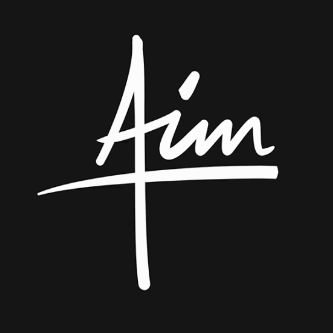

# AIMBOT.AD - 모듈형 디스코드 봇



AIMBOT.AD는 모듈형 디스코드 봇과 웹 대시보드를 통합한 프로젝트입니다. 다양한 모듈을 추가하여 디스코드 서버를 원하는 대로 커스터마이징할 수 있습니다.

## 주요 기능

- **모듈형 구조**: 필요한 기능만 선택하여 가볍고 효율적인 봇을 구성할 수 있습니다.
- **웹 대시보드**: 웹 인터페이스에서 편리하게 봇을 관리하고 모니터링할 수 있습니다.
- **실시간 통계**: 명령어 사용량, 서버 정보 등 다양한 통계를 실시간으로 확인할 수 있습니다.
- **보안 강화**: 환경 변수 관리, 암호화, XSS 방지 등 다양한 보안 기능을 제공합니다.

## 시작하기

### 필수 조건

- Node.js 16.9.0 이상
- npm 또는 yarn
- Discord 봇 토큰 및 애플리케이션 ID

### 설치 방법

1. 저장소 클론
```bash
git clone https://github.com/your-username/aimbot-ad.git
cd aimbot-ad
```

2. 의존성 설치
```bash
npm install
```

3. 환경 설정
`.env.example` 파일을 복사하여 `.env` 파일 생성 후 필요한 정보 입력:
```bash
cp .env.example .env
```

4. 슬래시 명령어 등록
```bash
npm run deploy
```

5. 봇 실행
```bash
npm start
```

### Docker를 사용한 설치

1. Docker Compose로 실행
```bash
docker-compose up -d
```

2. 로그 확인
```bash
docker-compose logs -f
```

## 모듈 추가 방법

1. `modules/commands/` 디렉토리에 새 명령어 모듈 생성
2. `modules/events/` 디렉토리에 새 이벤트 핸들러 모듈 생성
3. `web/webmodules/` 디렉토리에 새 웹 모듈 생성

### 명령어 모듈 예시

```javascript
const { SlashCommandBuilder } = require('discord.js');

module.exports = {
  data: new SlashCommandBuilder()
    .setName('명령어이름')
    .setDescription('명령어 설명'),
  
  async execute(interaction, args, client) {
    // 명령어 실행 로직
  },
  
  async executeFromWeb(params, client) {
    // 웹에서 실행 시 로직
  }
};
```

### 웹 모듈 예시

```javascript
const express = require('express');
const router = express.Router();

function init(app, wsClient) {
  // 모듈 초기화 로직
}

async function handleRequest(action, params, client) {
  // 웹에서 요청 처리 로직
}

module.exports = {
  name: '모듈이름',
  description: '모듈 설명',
  routes: router,
  init,
  handleRequest
};
```

## 프로젝트 구조

```
aimbot-ad/
├── .env                  # 환경 변수 파일
├── config.js             # 설정 로더
├── main.js               # 메인 봇 애플리케이션
├── modules/              # 봇 모듈 디렉토리
│   ├── commands/         # 봇 명령어
│   └── events/           # 봇 이벤트 핸들러
├── utils/                # 유틸리티 디렉토리
└── web/                  # 웹 대시보드 디렉토리
    ├── index.js          # 웹 서버
    ├── webmodules/       # 웹 모듈 디렉토리
    └── public/           # 정적 파일 디렉토리
```

## 기여하기

1. 프로젝트 포크
2. 기능 브랜치 생성 (`git checkout -b feature/amazing-feature`)
3. 변경사항 커밋 (`git commit -m 'Add some amazing feature'`)
4. 브랜치에 푸시 (`git push origin feature/amazing-feature`)
5. Pull Request 생성

## 라이선스

이 프로젝트는 MIT 라이선스로 배포됩니다. 자세한 내용은 [LICENSE](LICENSE) 파일을 참조하세요.

## 연락처

프로젝트 관리자 - 이메일 주소 - 웹사이트

프로젝트 링크: [https://github.com/your-username/aimbot-ad](https://github.com/your-username/aimbot-ad)
